# Neptune Dashboard Features

## Organization Search

Ability to search for organizations by name.

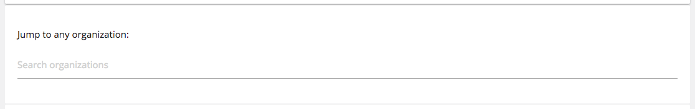

## Program Select

Ability to select the program you'd like to view.

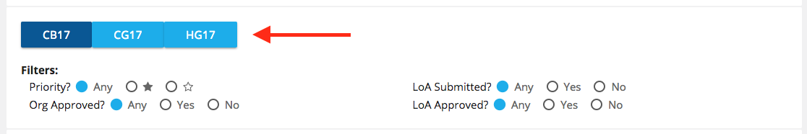

## Filters

Ability to filter participating organizations based on criteria. These can be combined. So, for example, you can select organizations that have been approved but that have not yet submitted an LoA.

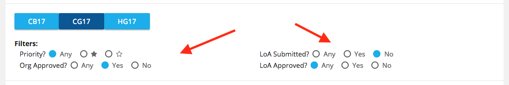

## Sorting

Ability to sort on columns. You can sort within a filtered list.

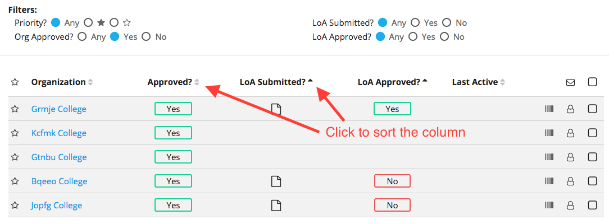

## Match Count

Ability to see the number of organizations that match the selected criteria.

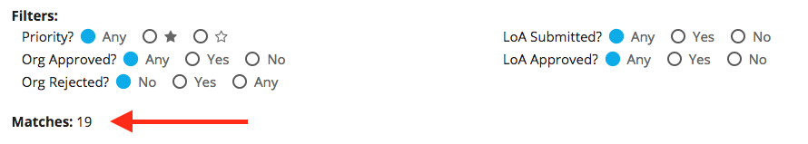

## Organization POID

Ability to update an organization's POID.

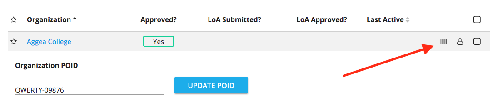

## Liaison Information

Ability to view liaison information.

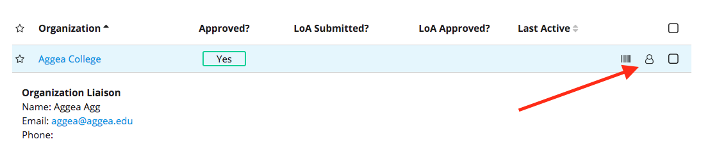

## Liaison Contact List

Ability to retrieve contacts information for the liaisons of multiple organizations.

First, select the organizations you'd like to contact.

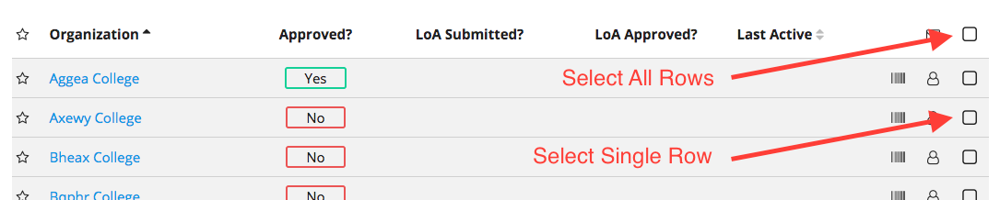

Then, click the email icon located in the table header row.

You'll be provided with a list of liaison names, liaison emails, and organizations of the selected rows. This can be copy and pasted directly into a Google Spreadsheet.

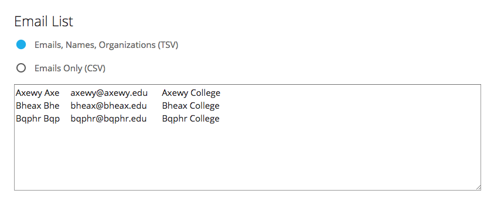

You can also select CSV to receive an email only list, separated by commas, that can be copy and pasted into a Gmail BCC list.

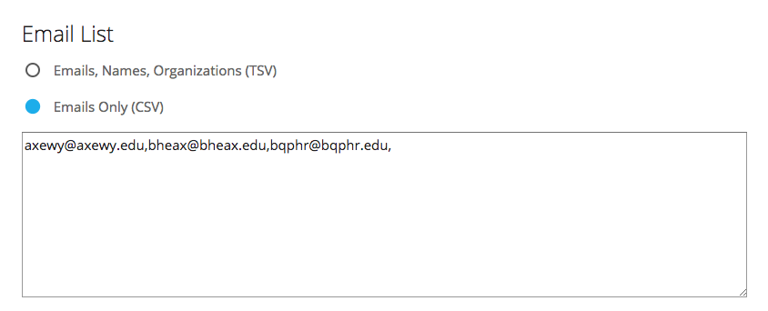

## Approve / Reject an Organization

Ability to approve / reject an organization. To approve or reject an organization, hover over the **Approved?** status indicator.

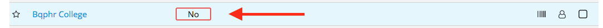

Then, select to approve (`thumbs-up` icon) or reject (`reject` icon).

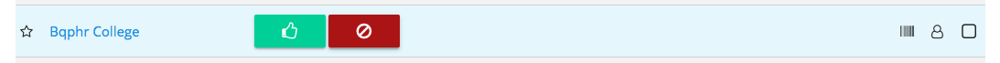

By default, rejected organizations won't appear on the dashboard, but you can view them by setting the **Org Rejected** filter to **Yes** or **Any**.

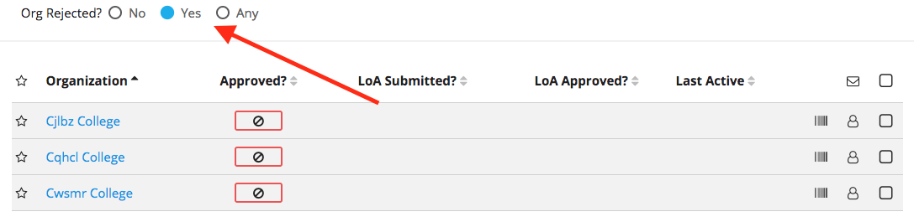

## Letter of Agreements

Ability to view Letter of Agreements. When a Letter of Agreement has been submitted, a `file` icon will appear in the **LoA Submitted?** column. Click on the icon to view the attachment.

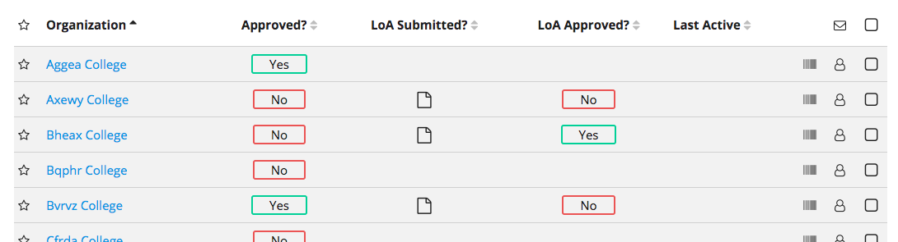

## Approve / Reject a Letter of Agreement

Ability to approve / reject a Letter of Agreement. When a Letter of Agreement has been submitted, along with the `file` icon that appears, a `[No]` status indicator will appear in the **LoA Approved?** column. To approve or reject, hover over this status indicator.

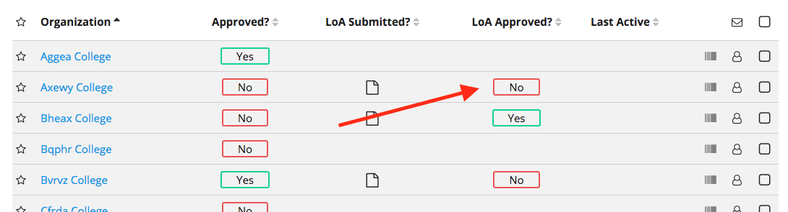

Then, select to approve (`thumbs-up` icon) or reject (`reject` icon).

**Note**: at the moment, you also need to add an Organiztion POID for an organization to be marked complete in the tasklist. This is important since the tasklist status will determine if an organization can proceed with participation.

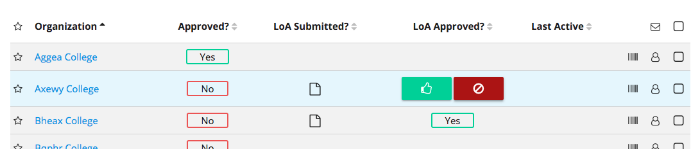

### Rejected

If you reject a Letter of Agreement, it will be removed from the dashboard...

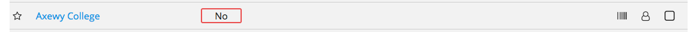

...and a note will appear in the tasklist leting organization members know they will need to submit revisions.

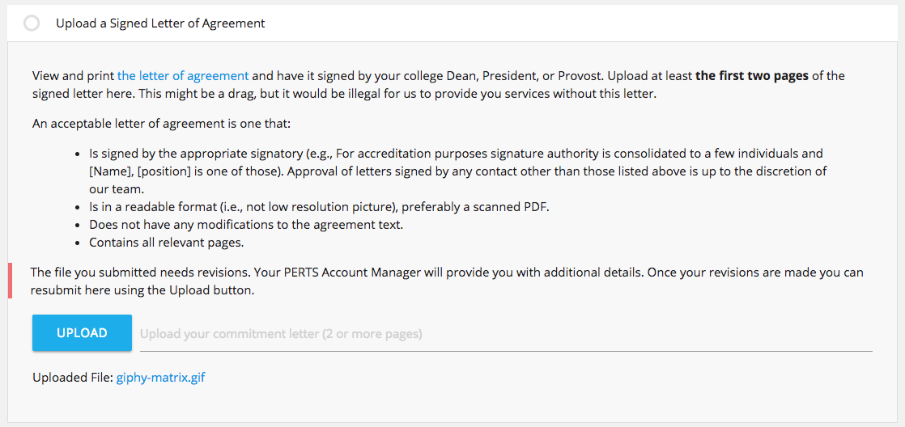

### Approved

If you approve an Letter of Agreement, a `[Yes]` status indicator will appear in the **LoA Approved?** column.

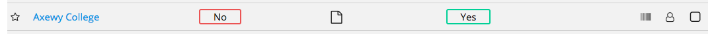
