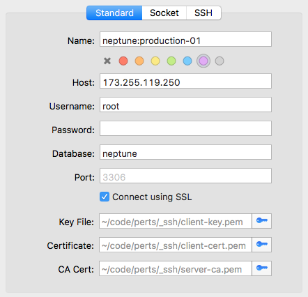
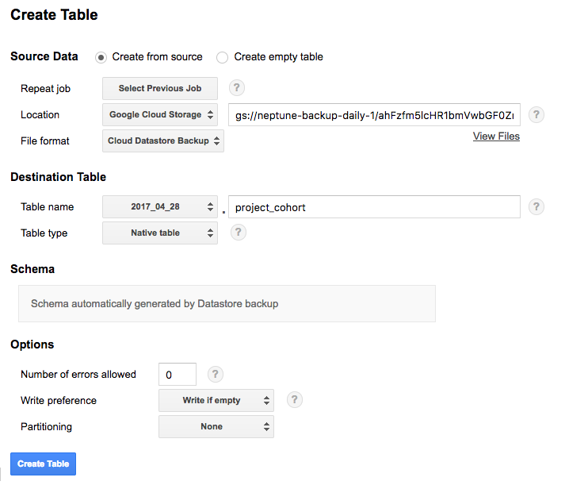

# Neptune Admin Tasks

## Server Environments

[Environments Spreadsheet][5]

## Access Server Logs

### Access Log Viewer

* Access the [Google Cloud Platform Console][1].
* Select **Neptune** (neptuneplatform) from the project menu.
* Select **Logging** from the Products & Services menu.

### Access Error Reporting

* Access the [Google Cloud Platform Console][1].
* Select **Neptune** (neptuneplatform) from the project menu.
* Select **Error Reporting** from the Products & Services menu.

## Accessing Production & Replica Databases (SQL)

* Access the [Google Cloud Platform Console][1].
* Select **Neptune** (neptuneplatform) from the project menu.
* Select **SQL** from the Products & Services menu.
* Select **production-1** (production) or **production-1-analysis-replica** (replica) from the SQL menu.

### Create a Client Certificate

* Select **Access Control**.
* Select **SSL**.
* Select **Create a Client Certificate**.
* Enter a user friendly name for your client certificate.
* Once created, you will have an opportunity to download key, client cert, and server cert files. Save these on your workstation.

### Add your IP to Authorize Networks

* Select **Access Control**.
* Select **Authorization**.
* Select **Add network**.
* Enter a user friendly name for yourself.
* Enter your IP address.
    * You can find your IP address using a site like [What's My IP Address?][7].
* Select **Done**.
* Select **Save**.

### Connecting with SequelPro

Use the key, client cert, and server cert that you received above, along with the following settings, to connect using SequelPro.



## Datastore

### Updating Indexes

Google Cloud Datastore uses [indexes](https://cloud.google.com/datastore/docs/concepts/indexes) to perform queries. Composite indexes are defined in the `index.yaml` file. When developing locally, `index.yaml` will usually update automatically when the SDK determines it's needed.

So, when `index.yaml` updates, before releasing the code that caused the update into production, do the following.

* Open **terminal**.
* `cd` to your local working directory.
* Enter `appcfg.py update_indexes ./`.
* Go to [Google Cloud Platform Console: Datastore: Indexes][6] to monitor the index build progress.
* Once the status of the new index turns to **Serving** it is safe to release the new code.

## BigQuery

In order to work with data from Datastore in BigQuery, you need to import the Database Entity backup(s) that you'd like to work with into BigQuery.

### Finding a Database Entity Backup URL

* Access the [Google Cloud Platform Console][1].
* Select **Neptune** (neptuneplatform) from the project menu.
* Select **Storage** from the Products & Services menu.
* Select **Browser** from the Storage menu.
* Determine and select the backup you want to use.
    * Backups are on a two day rotation, so if you are looking for the most recent backup, you will need to click into **neptune-backup-daily-1** and **neptune-backup-daily-2** to see which backup is most recent.
* Find the backup file for the Datastore Entity you want to export.
    * If the file names are too long to read to the end (which is where the Entity name is found), then hover over the file until the entire file name pops up.
* Copy the URL of the Entity backup file you'd like.
* Replace `https://storage.cloud.google.com/` with `gs://`.

> :point_up: Not all Datastore Entities are being backed up. Noting in case that's in error.

### Importing a Database Entity Backup into BigQuery

* Access the [Google Cloud Platform Console][1].
* Select **Neptune** (neptuneplatform) from the project menu.
* Select **BigQuery** from the Products & Services menu.
* Select **Create new dataset** from the "arrow" menu, next to **Neptune**.
* Enter the following details into the **Create Dataset** dialog window:
    * **Dataset ID**: date with format `YYYY_MM_DD` (eg, `2017_04_27`)
* Press **OK** to create the dataset.
* Select the "plus" (Create Table) icon next to the dataset you just created.
* Select **Google Cloud Storage** from the **Location** option.
* Enter the Database Entity URL you found above into the **Location** field.
    * If the file URL ends with a `_qa` query parameter like `?_ga=1.170920288.1506250172.1485196699` and you receive an error attempting to import, you may need to remove it.
* Select `Cloud Datastore Backup` from the **File format** option.
* Enter the table name into **Destination Table > Table name** field.
    * Our naming convention is lowercase & snake_case.
    * Eg, `ProjectCohort` becomes `project_cohort`.
* Select **Create Table**.



### Additional Documentation

* See [Exporting CSVs from BigQuery][2].
* See [Loading Data from Cloud Storage][3].

## Batch Update via Browser Console

You can access AngularJS services like this:

```
var injector = angular.element(document.body).injector();
var Project = injector.get('Project');
Project.query();
```

This allows you to perform batch updates, like the following:

```
var injector = angular.element(document.body).injector();
var Project = injector.get('Project');
Project.query({ n: 500 }).$promise
  .then(function updateProjects (projects) {
    projects.map(function putProject (project) {
      // Do something with the project here,
      // Then update the project.
      Project.put(project).then(function (p) {
        console.log('Updated', p);
      });
    });
  });
```

Also, see [#507](https://github.com/PERTS/neptune/pull/507) for another example of potential usage.

## Mandrill

To manage email templates:

* Access [Mandrill](https://mandrillapp.com).
* Select **Log In Through MailChimp**.

## Manage Email Forwarding Rules

* See [Forwarding Email][4] for details.

---

[1]: https://console.cloud.google.com/home/dashboard?project=neptuneplatform
[2]: https://docs.google.com/document/d/1lPvVUkQ71I5qgj207CzoVDSBv0JKWTv3jtRvKEHMZV0
[3]: https://cloud.google.com/bigquery/docs/loading-data-cloud-storage
[4]: https://docs.google.com/document/d/12ffpy2bqmol1rdjEKyiWFQDLnjphlxTdc4gsdDCqde0
[5]: https://docs.google.com/spreadsheets/d/15JDSlSOkOpoXoP7jmLCgBlzxhwo1GGQS_IRr7YcclEU
[6]: https://console.cloud.google.com/datastore/indexes?project=neptuneplatform
[7]: http://www.whatsmyip.org/
